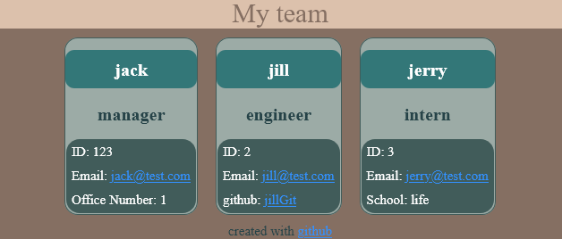

<TEAM-INFO-GENERATOR>

# Team info page generator 

## 0.Description:

A command line application that generates an html page from the information passed in.

## 1.Installation:

clone this repo.

## 2.Usage:

first youre going to have to install some dependencies so run this in the directory containing the package.json file:
    npm i

then in that same directory run:
    node index.js

[A video demonstration](#add a link)

## 3.Credits:

All work done by Malik Kouyate(mkalik)

The styling was done via [Bulma](https://bulma.io/documentation/) And the icons were generated via [Font Awesome](https://fontawesome.com/)

